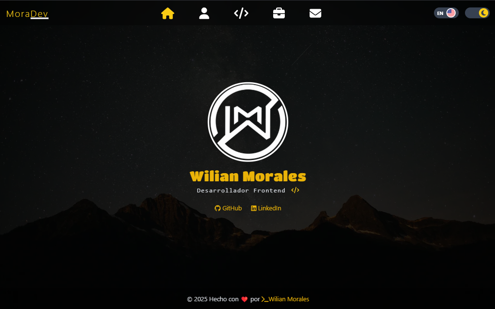

# 🚀 My Portfolio

## 📌 Descripción del Proyecto

Este es un proyecto personal donde muestro mis habilidades como desarrollador web utilizando tecnologías modernas. Aquí podrás encontrar información sobre mí, mis proyectos, habilidades y un formulario de contacto funcional.

##### 🌐 El proyecto está desplegado en GitHub Pages. Puedes ver la DEMO: [MyPortfolio](https://wilianmorales.github.io/my-portfolio)



## 🛠️ Tecnologías utilizadas
- Frontend: Angular 17

- Estilos: Tailwind CSS

- Backend: CloudFlare (para el envio del formulario)

- Despliegue: GitHub Page

## 📄 Estructura del proyecto
El sitio está dividido en varias secciones:

- About: Información sobre mí

- Skills: Lista de mis habilidades técnicas

- Projects: Muestra de mis proyectos destacados

- Contact: Formulario para que puedas ponerte en contacto conmigo​

### 🤝 Contribuciones
¡Las contribuciones son bienvenidas! Si tienes sugerencias o mejoras, no dudes en abrir un issue o enviar un pull request. Estoy abierto a ideas que puedan mejorar este proyecto.

### 📬 Contacto
Si deseas ponerte en contacto conmigo, puedes hacerlo a través del formulario en la sección de contacto de mi portfolio

## 🔧 Instalación
Para ejecutar este proyecto localmente, sigue estos pasos:

1. Clona el repositorio:​
```bash
git clone https://github.com/WilianMorales/my-portfolio.git
cd my-portfolio
```
2. Instala las dependencias:​
```bash
npm install
```
3. Inicia el servidor de desarrollo:​
```bash
ng serve -o
ng serve --host IP_DE_TU_RED
```

## Dependencias implementadas:
* Tailwind cSS
```
npm install -D tailwindcss postcss autoprefixer
npx tailwindcss init -p
```
* Ngx-Translate   core/http-loader
```
npm install @ngx-translate/core @ngx-translate/http-loader
```
* Ngx-Toastr y @angular/animations
```
npm install ngx-toastr @angular/animations
```
* Fontawesome
```
npm install @fortawesome/angular-fontawesome@0.14.1 @fortawesome/fontawesome-svg-core @fortawesome/free-solid-svg-icons @fortawesome/free-brands-svg-icons
```
* angular-cli-ghpages
```
ng add angular-cli-ghpages
```

> [!NOTE]
> 📄 This project by **Wilian Morales** is licensed under the [CC BY-NC 4.0](https://creativecommons.org/licenses/by-nc/4.0/) license.
