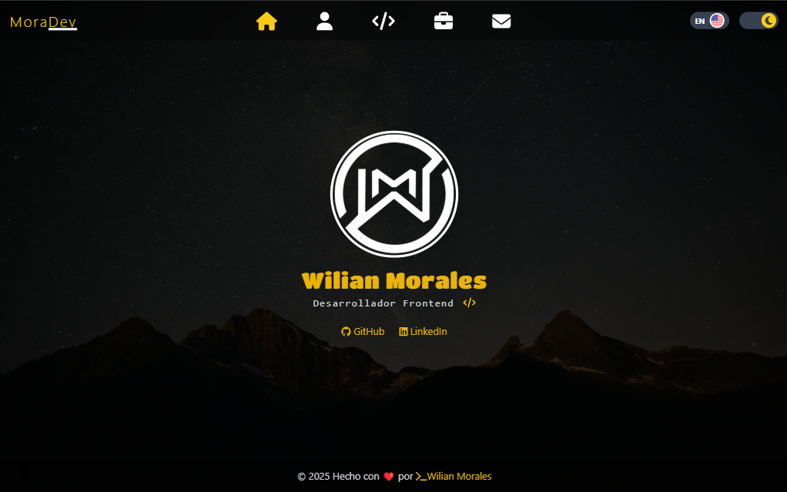

# 🚀 My Portfolio

## 📌 Descripción del Proyecto

Este es un proyecto personal donde muestro mis habilidades como desarrollador web utilizando tecnologías modernas. Aquí podrás encontrar información sobre mí, mis proyectos, habilidades y un formulario de contacto funcional.

##### 🌐 El proyecto está desplegado en GitHub Pages. Puedes ver la DEMO: [MyPortfolio](https://wilianmorales.github.io/my-portfolio)



## 🛠️ Tecnologías utilizadas
- **Frontend:** Angular 19
- **Estilos:** Tailwind CSS
- **Internacionalización:** ngx-translate (ES / EN)
- **Iconos:** Font Awesome (`@fortawesome/angular-fontawesome`)
- **Backend:** Cloudflare Worker (envío del formulario de contacto)
- **Despliegue:** GitHub Pages (CI/CD con GitHub Actions)

## 📄 Estructura del proyecto

El sitio está dividido en varias secciones:

- **Home**: Landing con presentación y enlaces a redes.
- **About**: Información sobre mí, incluye el resumen (educación y experiencia).
- **Skills**: Categorías de habilidades técnicas (frontend, backend, herramientas).
- **Projects**: Muestra de proyectos destacados.
- **Contact**: Formulario de contacto con validaciones y protección Cloudflare Turnstile.

### 🤝 Contribuciones
¡Las contribuciones son bienvenidas! Si tienes sugerencias o mejoras, no dudes en abrir un issue o enviar un pull request. Estoy abierto a ideas que puedan mejorar este proyecto.

### 📬 Contacto
Si deseas ponerte en contacto conmigo, puedes hacerlo a través del formulario en la sección de contacto de mi portfolio.

## 🔧 Instalación
Para ejecutar este proyecto localmente, sigue estos pasos:

1. Clona el repositorio:​
```bash
git clone https://github.com/WilianMorales/my-portfolio.git
cd my-portfolio
```
2. Instala las dependencias:​
```bash
npm install
```
3. Inicia el servidor de desarrollo:​
```bash
ng serve -o
ng serve --host IP_DE_TU_RED
```

## 🧪 Scripts disponibles

```bash
npm start              # ng serve
npm run build          # ng build
npm run build:prod     # ng build --configuration production --base-href /my-portfolio/
npm run test           # vitest run
npm run test:watch     # vitest (modo watch)
npm run test:coverage  # vitest run --coverage
npm run lint           # ng lint
npm run format         # prettier --write
```

## 🚢 Despliegue

El despliegue a GitHub Pages es automático mediante GitHub Actions (`.github/workflows/deploy.yaml`) en cada push a `master`: instala dependencias, compila en modo producción y publica con `angular-cli-ghpages`.

## Dependencias implementadas:
* Tailwind CSS
```
npm install -D tailwindcss postcss autoprefixer
npx tailwindcss init -p
```
* Ngx-Translate core/http-loader
```
npm install @ngx-translate/core @ngx-translate/http-loader
```
* Ngx-Toastr y @angular/animations
```
npm install ngx-toastr @angular/animations
```
* Fontawesome
```
npm install @fortawesome/angular-fontawesome @fortawesome/fontawesome-svg-core @fortawesome/free-solid-svg-icons @fortawesome/free-brands-svg-icons
```
* angular-cli-ghpages
```
ng add angular-cli-ghpages
```
* ESLint y Prettier
```
ng add @angular-eslint/schematics
npm install -D prettier eslint-config-prettier eslint-plugin-prettier prettier-plugin-tailwindcss
```

> [!NOTE]
> 📄 This project by **Wilian Morales** is licensed under the [CC BY-NC 4.0](https://creativecommons.org/licenses/by-nc/4.0/) license.
